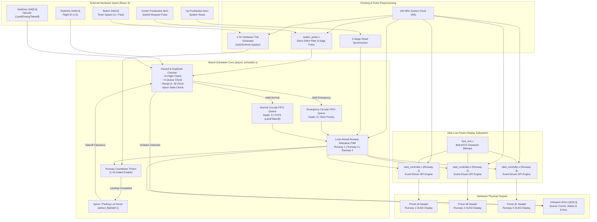

# FPGA-Based-Multi-Runway-Scheduling-Collision-Prevention-Real-Time-Monitoring

[](https://www.xilinx.com/products/silicon-devices/fpga/artix-7.html)
[](https://digilent.com/reference/programmable-logic/basys-3/start)
[]()
[]()
[]()
[-success.svg)]()
[]()

A synthesizable, hardware-deterministic **Airport Runway Traffic Scheduler and Visual Management System** implemented in Verilog HDL for the **Digilent Basys 3 FPGA**. 

The system provides autonomous multi-runway allocation across three physical runways, featuring strict emergency priority preemption, First-Come-First-Served (FCFS) queuing, hazard and duplicate flight request rejection, and an automated gate/apron parking manager. Active runway status, aircraft IDs, flight modes, and live countdown timers are driven to three independent **Digilent Pmod OLED** displays (SSD1306 128x32 monochrome) via dedicated SPI controllers engineered from the ground up for **ultra-low power consumption (<100 mW total on-chip power)**.

---

## 📑 Table of Contents
1. [System Architecture](#-system-architecture)
2. [Key Technical Highlights](#-key-technical-highlights)
3. [Scheduling & Arbitration Engine](#-scheduling--arbitration-engine)
4. [Ultra-Low-Power Hardware Architecture](#-ultra-low-power-hardware-architecture)
5. [OLED Visual Interface & Screen Layout](#-oled-visual-interface--screen-layout)
6. [Basys 3 Hardware Pinout & Mapping](#-basys-3-hardware-pinout--mapping)
7. [Repository File Structure](#-repository-file-structure)
8. [Simulation & Verification Suite](#-simulation--verification-suite)
9. [FPGA Implementation & Synthesis Metrics](#-fpga-implementation--synthesis-metrics)
10. [Quickstart: How to Build & Run in Vivado](#-quickstart-how-to-build--run-in-vivado)
11. [License](#-license)

---

## 🏛️ System Architecture



---

## ⚡ Key Technical Highlights

- **Multi-Runway Concurrent Scheduling**: Arbitrates across three independent runways simultaneously. Includes zero-bubble look-ahead recycling ($T=1$ countdown handover) so subsequent queued flights are scheduled without dead time.
- **Dual-Queue Strict Priority Preemption**:
  - **Emergency Queue**: Dedicated circular FIFO buffer (depth 9). Emergency requests immediately jump ahead of all normal traffic, claiming the next available runway.
  - **Normal Queue**: Dedicated circular FIFO buffer (depth 9). Manages standard landings and takeoffs in fair First-Come-First-Served (FCFS) order.
- **Multi-Hazard Safety & Request Rejection**:
  - Rejects duplicate requests for aircraft already active on any runway.
  - Rejects duplicate requests for aircraft currently waiting in either queue.
  - Rejects takeoff requests for aircraft not currently confirmed on the parking apron.
  - Rejects out-of-range flight IDs (`ID == 0` or `ID > 9`) and invalid operation codes (`2'b00`).
  - Queue full overflow prevention.
- **Integrated Apron / Gate Parking Tracker**:
  - Internal 9-bit register vector (`parked_flights[9:1]`) tracks landed aircraft. Aircraft transition automatically from runway to parking when landing timers expire.
- **Full Hardware Power Sequencing for SSD1306 OLEDs**:
  - Exact compliance with Digilent Pmod OLED power requirements: VDD logic enable $\rightarrow$ 20 ms delay $\rightarrow$ RES# hardware pulse $\rightarrow$ initialization commands $\rightarrow$ VBAT power enable $\rightarrow$ 100 ms delay $\rightarrow$ Display ON (`0xAF`).
- **Complete Timing Closure at 100 MHz**:
  - Fully routed on Artix-7 with Worst Negative Slack (WNS) = **+0.664 ns** and Worst Hold Slack (WHS) = **+0.102 ns** with zero timing violations.

---

## 🧠 Scheduling & Arbitration Engine

The scheduler operates as a synchronous deterministic state machine clocked at 100 MHz with runway allocation governed by the following precedence rules:

| Priority | Request Class | Opcode (`req_type`) | Runway Action | Behavior & Queue Rules |
|:---:|:---:|:---:|:---:|---|
| **1 (Highest)** | **Emergency Landing** | `2'b10` | Claims next free runway immediately | Queues into `emerg_q`. Always allocated ahead of any waiting normal landing or takeoff. Multiple emergencies are served FCFS amongst themselves. |
| **2** | **Normal Landing** | `2'b01` | Claims next free runway | Queues into `norm_q`. Allocated only when `emerg_q` is empty. Upon timer expiry, the aircraft moves to `parked_flights`. |
| **3** | **Scheduled Takeoff** | `2'b11` | Claims next free runway | Queues into `norm_q`. Aircraft must already be in `parked_flights`. Clears parking flag upon allocation and frees runway upon timer expiry. |

### Runway Look-Ahead Recycling
To eliminate pipeline bubbles between aircraft, the allocation logic monitors:
$$\text{Runway Ready} = (\text{runway\_flight} == 0) \;\lor\; (\text{timer} == 1 \;\land\; \text{timer\_tick})$$
When a runway timer reaches its final tick ($T=1$), the exiting aircraft is parked or cleared, and the top queued flight is allocated into the runway pipeline on that exact cycle.

---

## 🔋 Ultra-Low-Power Hardware Architecture

Standard display drivers waste significant power by continuously toggling high-frequency clock lines and pushing high currents through OLED pixels. This project cuts power via three cross-layer architectural techniques, resulting in **only 99 mW total FPGA on-chip power**:

```
+---------------------------------------------------------------------------------+
|                       TOTAL ON-CHIP POWER: 99 mW                                |
|  [ Device Static: 72 mW (72.7%) ]  |  [ Dynamic Switching: 27 mW (27.3%) ]     |
+---------------------------------------------------------------------------------+
```

### 1. Event-Driven SPI Engine with Clock & Bus Quieting
- **Zero-Activity Idle State**: Traditional SPI drivers stream frames at 60 Hz continuously. In this design, the controller enters `ST_IDLE` once a screen draw completes.
- **Physical Line Quieting**: While in `ST_IDLE`, `oled_sclk` is clamped static low, `oled_cs_n` is deasserted high, and data lines remain constant.
- **Mathematical Impact**: Dynamic switching power ($P = \alpha \cdot C \cdot V^2 \cdot f$) drops to near zero ($\alpha \approx 0$) for **>99.5%** of runtime, activating only when a flight is assigned or the timer changes.

### 2. Display Panel Power Optimization (~75% Reduction)
- **Low-Contrast Configuration (`0x81, 0x15`)**: Standard initialization sets SSD1306 contrast to maximum (`0xFF` / `0x8F`), pulling up to 25 mA per OLED panel. We initialize with contrast `0x15`, providing crisp indoor readability while dropping panel current below **6 mA**.
- **Dark Typography (<15% Active Pixels)**: OLED pixels consume power only when lit. Characters are rendered using a 1-pixel stroke 8x8 font against a black background, keeping >85% of display pixels completely off ($0\text{ mA}$).
- **Precharge Period Optimization (`0xD9, 0x22`)**: Low-power charge-pump timing reduces switching losses during pixel refresh.

### 3. Gated Hardware Clocking
- Rather than decrementing runway timers at the raw 100 MHz clock rate, timer registers are gated by a single-cycle 1 Hz enable pulse (`timer_tick_1s`). This reduces toggle activity in the countdown datapath by a factor of **$10^8$**.

---

## 📺 OLED Visual Interface & Screen Layout

Each runway is monitored by its own 128x32 monochrome display formatted into four clean 16-character alphanumeric text lines:

### State 1: Runway Available (FREE)
```
+------------------+
| RUNWAY 1: FREE   |  Line 0: Runway ID and availability status
| FLIGHT: NONE     |  Line 1: No aircraft assigned
| TYPE: NONE       |  Line 2: No active operation
| RUNWAY READY     |  Line 3: Safety clearance message
+------------------+
```

### State 2: Active Runway (BUSY - Emergency Landing)
```
+------------------+
| RUNWAY 1: BUSY   |  Line 0: Runway ID and busy indicator
| FLIGHT: #05      |  Line 1: Aircraft ID (#01 to #09)
| TYPE: EMERGENCY  |  Line 2: Operation (EMERGENCY / LANDING / TAKEOFF)
| TIME: 12S LEFT   |  Line 3: Live real-time seconds countdown
+------------------+
```

### State 3: Active Runway (BUSY - Normal Takeoff)
```
+------------------+
| RUNWAY 3: BUSY   |  Line 0: Runway ID and busy indicator
| FLIGHT: #04      |  Line 1: Aircraft ID
| TYPE: TAKEOFF    |  Line 2: Operation
| TIME: 08S LEFT   |  Line 3: Countdown until runway is clear
+------------------+
```

---

## 🎛️ Basys 3 Hardware Pinout & Mapping

The design is mapped to the standard Digilent Basys 3 board resources:

### Control Inputs & Mode Switches
| Pin Name | Board Hardware | Function | Description |
|---|---|---|---|
| `clk` | Oscillator (Pin `W5`) | 100 MHz System Clock | Primary master clock source |
| `btnU` | Top Button | Master Reset | Synchronous system-wide reset |
| `btnC` | Center Button | Submit Request | Debounced single-cycle request pulse |
| `sw[3:0]` | Slide Switches | Aircraft ID | Binary flight ID (`0001` = Flight 1 ... `1001` = Flight 9) |
| `sw[5:4]` | Slide Switches | Request Type | `01`: LANDING \| `10`: EMERGENCY \| `11`: TAKEOFF |
| `sw[15]` | Slide Switch | Timer Speed | `0`: 1-second real-time countdown \| `1`: Fast demo mode |

### Status Indicators (LEDs)
| Pin Name | Board Hardware | Function | Description |
|---|---|---|---|
| `led[3:0]` | LEDs (LD3..LD0) | Emergency Queue Count | Current flights waiting in emergency queue |
| `led[7:4]` | LEDs (LD7..LD4) | Normal Queue Count | Current flights waiting in normal queue |
| `led[8]` | LED (LD8) | Allocation Valid | Single-cycle flash when a flight is assigned |
| `led[9]` | LED (LD9) | Request Rejected | Lights up if request is illegal or duplicate |
| `led[13:10]`| LEDs (LD13..LD10) | Flight ID Echo | Real-time echo of `sw[3:0]` |
| `led[15:14]`| LEDs (LD15..LD14) | Request Type Echo | Real-time echo of `sw[5:4]` |

### Pmod OLED Display Headers (12-Pin Pmod)
| Pmod Pin | Signal | Pmod JA (Runway 1) | Pmod JB (Runway 2) | Pmod JC (Runway 3) | Description |
|---|---|:---:|:---:|:---:|---|
| Pin 1 | `oled_cs_n` | `J1` | `A14` | `K17` | SPI Chip Select (Active Low) |
| Pin 2 | `oled_sdin` | `L2` | `A16` | `M18` | SPI Serial Data (MOSI) |
| Pin 4 | `oled_sclk` | `G2` | `B16` | `P18` | SPI Serial Clock (1.0 MHz) |
| Pin 7 | `oled_dc` | `H1` | `B15` | `L17` | Data/Command Select (0=Cmd, 1=Data) |
| Pin 8 | `oled_res_n` | `K2` | `C16` | `M19` | OLED Reset (Active Low) |
| Pin 9 | `oled_vbat` | `H2` | `C15` | `P17` | Display Power Enable (Active Low) |
| Pin 10 | `oled_vdd` | `G3` | `A15` | `R18` | Logic Power Enable (Active Low) |

---

## 📁 Repository File Structure

```
Airport_Runway_Scheduler_Basys3/
├── rtl/
│   ├── airport_top.v            # Basys 3 top-level system integration wrapper
│   ├── airport_scheduler.v      # Core priority scheduler, queues, timers & apron logic
│   ├── oled_controller.v        # Ultra-low-power SSD1306 SPI display controller
│   ├── font_rom.v               # 8x8 ASCII font bitmap character generator
│   └── button_pulse.v           # 20ms debounce filter and edge-detect pulse generator
├── constr/
│   └── basys3_airport.xdc       # Complete physical XDC constraints (Pins, IOSTANDARD, Slew)
├── sim/
│   ├── airport_scheduler_tb.v   # Behavioral testbench verifying 12 scheduler edge-case scenarios
│   └── tb_airport_top.v         # End-to-end top-level board & OLED SPI bus testbench
├── docs/
│   └── waveform_behavioral.png  # Annotated Vivado simulation waveform
└── README.md
```

---

## 🧪 Simulation & Verification Suite

The repository includes two self-checking testbenches covering both unit-level scheduling logic and system-level SPI transactions.

### 1. Scheduler Core Verification (`airport_scheduler_tb.v`)
Verifies cycle-accurate scheduler behavior across 12 rigorous validation phases:
1. **Reset Verification**: Asserts `reset` and verifies all runways free, timers at 0, and queues cleared.
2. **Concurrent Runway Fill**: Requests landings for Flights 1, 2, and 3; confirms immediate parallel assignment to Runways 1, 2, and 3.
3. **Queueing Under Heavy Load**: Submits Normal Flight 4 (enters `norm_q`) and Emergency Flight 5 (enters `emerg_q`).
4. **Duplicate Rejection in Queue**: Re-submits Flight 4; confirms assertion of `req_rejected = 1`.
5. **Emergency Preemption on Expiry**: Waits `BUSY_CYCLES` until Runway 1 timer expires; verifies Emergency Flight 5 preempts Normal Flight 4 and takes Runway 1.
6. **Normal Queue Servicing**: Waits until Runway 2 timer expires; verifies Normal Flight 4 is allocated to Runway 2.
7. **Apron Parking Transition**: Verifies completed flights safely transition into the `parked_flights` vector.
8. **Duplicate Landing While Parked**: Submits landing request for parked Flight 4; confirms rejection.
9. **Valid Takeoff Execution**: Submits takeoff request for parked Flight 4; confirms valid allocation to next free runway.
10. **Illegal Takeoff Prevention**: Submits takeoff request for unlanded Flight 9; confirms immediate rejection.
11. **Boundary ID Checks**: Verifies rejection of Flight ID 0 and Flight ID 15.
12. **Undefined Opcode Handling**: Verifies rejection of invalid opcode `2'b00`.

### 2. End-to-End Top-Level Verification (`tb_airport_top.v`)
- Runs with `SIM_SPEEDUP = 1` for fast power-sequencing simulation.
- Simulates physical button bounce on `btnC` and verifies debounced single-pulse generation.
- Monitors `Pmod JA` SPI pins, counting SCLK transitions during screen updates and verifying that the SPI bus completely quiets down during idle states.

### Running Simulations in Vivado:
```tcl
# In the Vivado TCL Console:
launch_simulation -simset sim_1 -mode behavioral
run 1000ns
```

---

## 📊 FPGA Implementation & Synthesis Metrics

The design was synthesized, implemented, and fully routed using **AMD Xilinx Vivado 2025.1** targeting the **Artix-7 XC7A35T-1CPG236C**.

### Device Resource Utilization
| Resource | Used | Available | Utilization % |
|---|:---:|:---:|:---:|
| **Slice LUTs** | **1,304** | 20,800 | **6.27%** |
| ├── *LUT as Logic* | 1,222 | 20,800 | 5.88% |
| └── *LUT as Distributed RAM* | 82 | 9,600 | 0.85% |
| **Slice Registers (FF)** | **464** | 41,600 | **1.12%** |
| **Occupied Slices** | **436** | 8,150 | **5.35%** |
| **Block RAM (BRAM)** | **0** | 50 | **0.00%** |
| **DSP48 Slices** | **0** | 90 | **0.00%** |
| **User I/O Pins** | **42** | 106 | **39.62%** |

### Power Consumption (Vivado Report Power)
| Power Category | Dissipation (W) | Percentage | Notes |
|---|:---:|:---:|---|
| **Dynamic Power** | **0.027 W** | **27.3%** | Logic: 4 mW, Clocks: 3 mW, Signals/IO: 20 mW |
| **Device Static Power** | **0.072 W** | **72.7%** | Base Artix-7 static leakage at 25°C |
| **Total On-Chip Power** | **0.099 W** | **100.0%** | **Sub-100 mW thermal footprint** |
| *Junction Temperature* | *25.5 °C* | — | Thermal Margin: 59.5 °C (Max: 85 °C) |

### Timing Closure (Vivado Report Timing Summary)
| Parameter | Value | Target | Margin / Status |
|---|:---:|:---:|:---:|
| **Clock Frequency** | **100.00 MHz** | 100.00 MHz | Met (Period: 10.000 ns) |
| **Worst Negative Slack (WNS)** | **+0.664 ns** | 0.000 ns | **Passed (0 Failing Endpoints)** |
| **Worst Hold Slack (WHS)** | **+0.102 ns** | 0.000 ns | **Passed (0 Failing Endpoints)** |
| **Worst Pulse Width Slack (WPWS)** | **+3.750 ns** | 0.000 ns | **Passed (0 Failing Endpoints)** |

---

## 🚀 Quickstart: How to Build & Run in Vivado

### Prerequisites
- AMD Xilinx Vivado (2020.2 or later; tested with Vivado 2025.1)
- Digilent Basys 3 FPGA Development Board
- 1 to 3 Digilent Pmod OLED Displays (128x32 monochrome, SSD1306)
- Standard Micro-USB cable

### Project Setup in Vivado GUI
1. Open **Vivado** and choose **Quick Start $\rightarrow$ Create Project**.
2. Name the project `Airport_Scheduler` and choose **RTL Project** (uncheck *Do not specify sources at this time*).
3. In **Add Sources**, click **Add Files** and select all files from the `rtl/` and `sim/` directories.
4. In **Add Constraints**, click **Add Files** and select `constr/basys3_airport.xdc`.
5. In **Default Part**, select **Artix-7 $\rightarrow$ xc7a35tcpg236-1** (or select the *Digilent Basys 3* board if board files are installed).
6. Click **Finish**.

### Command-Line Script Setup (Vivado TCL)
Alternatively, create the project directly in the Vivado TCL shell:
```tcl
create_project Airport_Scheduler ./Airport_Scheduler -part xc7a35tcpg236-1
add_files [glob ./rtl/*.v]
add_files -fileset sim_1 [glob ./sim/*.v]
add_files -fileset constrs_1 ./constr/basys3_airport.xdc
update_compile_order -fileset sources_1
```

### Synthesis, Implementation, and Programming
1. Click **Generate Bitstream** in the Flow Navigator (Vivado will automatically run Synthesis and Implementation).
2. Once the bitstream is generated, plug the Basys 3 board into your PC via USB and power on the board.
3. Plug your Pmod OLED displays into **Pmod Headers JA, JB, and JC**.
4. In Vivado, click **Open Hardware Manager $\rightarrow$ Auto Connect $\rightarrow$ Program Device**.

### Operating the Hardware Demo
1. **Reset System**: Press pushbutton **btnU** once to initialize the scheduler and OLEDs. The displays will show `RUNWAY X: FREE`.
2. **Submit Normal Landing**:
   - Set `sw[3:0] = 4'b0001` (Flight #1).
   - Set `sw[5:4] = 2'b01` (Landing).
   - Press **btnC** once. Runway 1 OLED will immediately display `RUNWAY 1: BUSY | FLIGHT: #01 | TYPE: LANDING` with the countdown timer.
3. **Submit Emergency Landing**:
   - Set `sw[3:0] = 4'b0101` (Flight #5).
   - Set `sw[5:4] = 2'b10` (Emergency).
   - Press **btnC**. If all runways are busy, Flight #5 enters the emergency queue (`led[3:0]` shows count) and preemptively claims the very first runway that expires.
4. **Submit Takeoff**:
   - After Flight #1 lands and moves to the apron, set `sw[3:0] = 4'b0001` and `sw[5:4] = 2'b11` (Takeoff).
   - Press **btnC**. The scheduler authorizes takeoff clearance.

---

## 📜 License

This project is licensed under the **MIT License** - feel free to use, modify, and distribute for academic, educational, and commercial purposes.

